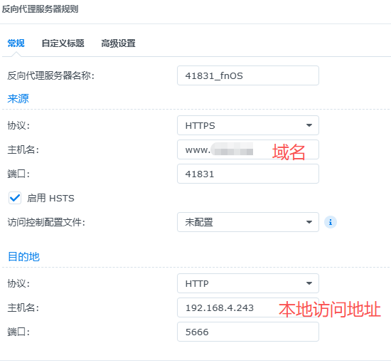
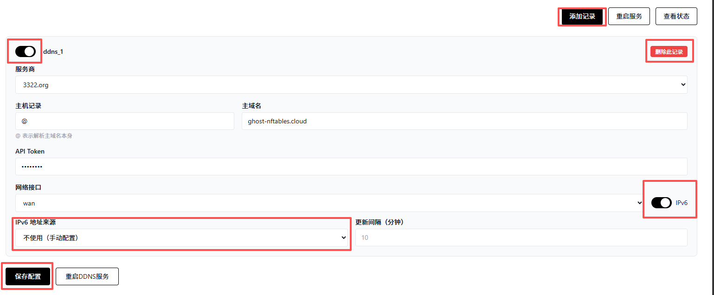
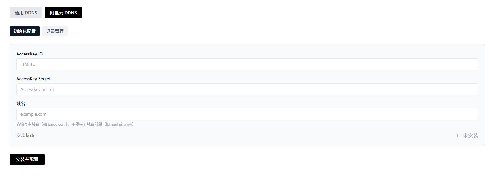
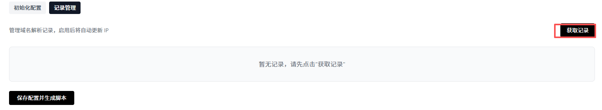

# NFTABLES防火墙简介

首先是防火墙的核心按钮：应用规则（web管理界面右上角），这个按钮按下确认后，规则才正式应用生效到防火墙。应用该防火墙后，会自动关闭iptable防护墙，避免冲突。改页面主要是讲解web管理界面的设置，因为目前为初代，有些按钮没有设置好可能会让用户产生疑惑，特此讲解。

‍

首先先了解一下：

#### 什么是端口敲门？

想象您的服务器是一栋房子，防火墙是大门，而各种服务（如Web管理后台、SSH）是房子里的房间。

- ​**传统模式**：大门一直敞开或虚掩，黑客可以全天候尝试撬锁（暴力破解密码、扫描漏洞）。
- ​**端口敲门**​：大门平时紧锁且隐形。只有当您在门外按照**特定的顺序**敲击（例如：先敲1下，再敲2下...），大门才会显形并为您打开。进入后，大门再次自动关闭隐形。

#### 2. 我们的方案有什么优势？

**核心优势：让您的服务器在公网“隐身”** 部署本功能后，您的Web管理界面或其他服务端口在公网扫描器看来是“完全关闭”的。

- ​**防扫描**：常见的端口扫描工具（如Nmap）无法发现您的服务端口，攻击者甚至不知道这里有一台服务器。
- ​**防暴力破解**：由于端口不响应，黑客的密码爆破工具根本无法连接，攻击在第一步就被阻断。
- **零日漏洞免疫**：即便服务本身存在漏洞，只要端口处于“隐身”状态，外部攻击代码无法触达服务，自然无法利用漏洞。

‍

简单的总结来说，防火墙默认对任何人都不开放，任何人访问服务器，都不会有任何回复，服务器处于**静默状态，IPV6访问无法绕过防火墙**。当你和防火墙对暗号，暗号正确，防火墙给你打开一个你专属的门，这个门只有你能进，其他人依旧**保持静默**，访问不会收到任何回复，但是你可以正常访问。你的web网页将收到保护，不被公网扫描器扫到，不会有人知道你的服务器是否在线。别人的攻击只会打在空气中。

PS：如果你设置的门只保持15秒，15秒内连接了ssh。这个时候，时间到了，门关闭了，但是已经保持连接的ssh将会持续连接，不受影响。

---

1.网络接口:

网络接口核心为“PPPOE宽带拨号”设置和“路由器网关 IP”。

------------网络接口

         |          |

         |          └---PPPOE拨号（开关），只需要直接输入宽带账号和密码即可，接口自动匹配。

        └---路由器网关 IP，默认输入的已经是自动匹配过的，只需要核对即可，可以ssh路由器后ifconfig核对信息。

完整后需要按3个按钮：1.保存网络配置 2.保存防火墙配置 3.应用规则（右上角），那么整个配置就完整应用了。

---

2.端口敲门。可以手动修改4个端口，需要按照顺序敲门，不然无法通过。敲门代码无格式限制。

端口敲门需要注意的点：

      1.请勿在连接不可信，或者公共WIFI的情况下进行端口敲门。

      2.建议手机移动网络，公司可信网络下进行敲门。

      3.端口敲门是明文传输的4个端口信息，但是敲门客户端发送的端口敲门会伪装，相对安全。总的来说，主要是敲门客户端的环境是否安全，移动网络和可信公司网络都是安全的。

      4.UDP敲门在公网传输一般来说是安全的，信息是难以截取的。

白名单超时设置就是您敲门后，门打开的时间，一般来说，仅连接SSH，只要网络稳定，时间短一点，连接SSH后关闭不影响。但是需要持续访问WEB页面，建议时间长一点，2-5小时，方便您操纵，不用反复敲门。一般来说5小时也是安全的。

---

3.端口转发。

    1.端口转发，来自外网访问的请求，会经过这个转发到内部的服务器上，但是只有敲门成功后的人才可以被转发。

    2.TCP端口就是你配置的外部暴漏端口，这个端口也对应于内部设备上的端口。比如你从外网访问的12000端口，转发的“目标服务器 IPv4”，那么目标服务器也是12000端口，是对应的。

    3.IPV6地址，就是“目标服务器 IPv6”地址，你需要填入他的本地IPV6，或者公网IPV6皆可，一次填入，后续自动更新！无需管理。

点击：1.保存配置  2.应用规则，那么规则就成功应用了。敲门后即可访问这些端口。

注意：这个端口是直接转发的，没用HTTPS的反代，建议您在nas上直接配置好https反代到指定端口。HTTP在网络上传输不是很安全。

如图群晖示例，反代服务器中配置的HTTPS端口为41831，那么端口转发设置中直接设置41831，那么通过“www.expl.com:41831"即可访问。

---

4.信任IP。

简介：主要是限制内网设备访问主路由。

LAN模式：运行内网服务直接访问主路由的LUCI管理界面，当前配置防火墙的WEB管理界面，SSH端口等等，无阻碍。

信任IP模式：目前只能配置一个，仅允许一个指定IP访问路由器的管理界面，SSH等，设置好了后一定要记住这个IP，其他设备不在这个IP，去设置手动设置这个IP也可以访问，如果忘记IP了，只能重置路由器了，重新配置所有设置了。

---

5.日志开关：

    1.IPv6 WAN↔LAN 日志，记录所有公网访问服务器的通过IPV6和内部设备交互的信息日志。不管内部发起还是外部发起统统记录，日志极多。

    2.WAN 丢弃日志：记录来自公网访问者的被拒绝的信息。

    3.LAN 丢弃日志：内部设备访问主路由被拒绝的信息。

    4.转发链日志：记录从公网发起连接的服务器访问内网设备，被拒绝的日志。

注意：此处日志开关的保存按钮在上方，是”保存配置”。

‍

    5.日志远程转发 (logd)，适用于接收日志的应用，比如群晖的日志中心，在群晖的日志中心开启日志接收，然后防护墙管理界面配置好群晖服务器的IP，日志接收端口（一般默认514），协议按照群晖那边的设置，设置了TCP就用TCP，设置了UDP就用UDP，建议UDP，轻量，降低网络和处理占用。

---

6.系统日志：

可以直接在管理界面查看日志。其中不同日志标签对应关系：

​`[port1900-drop]` 公网扫描端口

​`[BOTNET-PORT]`​，`[BOTNET-UDP]`僵尸网络合集

​`[DHCPv6-FLOOD]` 全局DHCPV6防洪水

​`[FRAG-ATTACK][IPV6-FRAG-ATTACK]`  碎片防御

​`[LAND-ATTACK-IP4]`​  `[LAND-ATTACK-IP6]` LAND攻击

​`[WAN-SPOOFED-IP6]`  内网IPV6通行

​`[BLACKLIST4]`​  `[BLACKLIST6]` 黑名单拦截

​`[BLACKLIST4-ADD]`​  `[BLACKLIST6-ADD] ` 敲门错误黑名单加入

​`[WAN-SPOOFED-IP4]`​  `[SPOOFED-IP6]` 伪装IP拦截

​`[FOREIGN-SCAN]`  国外IP拦截

​`[ICMPV6-SCAN-ACCEPT]`  ICMPV6通行日志

​`[WAN-DHCPv6-546/547]`  DHCPV6通行日志

​`[I4-ALV-T]`​  `[I4-ALV-UDP]` IPV4敲门成功后授权访问日志，TCP/UDP

​`[IPv6-WAN-DROP]`​  `[IPv4-WAN-DROP]`  外网访问拒绝日志

​`[KNOCK4-OK-S1]`....这种属于敲门记录。都是KNOCK开头的

​`[WAN-KNOCK4-SUCCEED]`  从外网敲门，KNOCK带SUCCEED属于敲门成功！

​`[IPv6-WAN-to-LAN-ATTEMPT]`   内外网交IPV6互所有日志，日志极多！

​`[I6-ALVN-T-1]`​  `[I6-ALVN-U-1] [I4-ALVN-T-1]`​  `[I4-ALVN-U-1]`配置的端口转发，转发访问成功后的记录，TCP/UDP IPV4/V6

​`[I6-NDP-DE]`  拒绝WAN到LAN的NDP

​`[I6-DEN-T-1]`​  `[I6-DEN-U-1] `  外网通过端口转发访问内网的拒绝日志

---

7.国外IP拦截

可以直接拦截国外的扫描和攻击，保持静默。

1.第一部需要点击安装/更新中国IP合集。然后再打开国外IP拦截的开关。

2.点击保存配置就正式生效了。单独打开开关无用。必须要先安装。

3.立即刷新中国IP，可以立即更新中国IP合集。非合集内的直接拒绝。默认是3天自动更新一次，无需管理。

4.开启国外IP访问拦截。

5.测试香港，澳门都会被拦截！如果身处香港澳门，需要手动配置中国IP地址集，或者关闭这个功能，因为服务器默认静默，即便让国外扫也无妨。

---

8.DDNS

**需要注意的点：IPV4敲门只需要更新路由器的公网IPV4到域名即可。但是IPV6敲门，需要分开，敲门敲更新了路由器的IPV6，访问用更新了NAS IPV6的域名。**

这个只需敲门客户端使用的路由器的域名敲门即可，打开浏览器使用NAS的域名即可。比如敲门使用exp.com，但是浏览器访问使用m.exp.com

‍

目前只测试了阿里云，腾讯云，cloufflare三个，运行正常。

除了阿里云DDNS，其他都在通用DDNS中。

1.通用DDNS，点击添加记录，记录框中左上角有一个开关，这个开关可以手动打开或者关闭同步。

2.添加记录就是新增DDNS更新记录。

3.删除记录，可以删除该框内的记录。

4.IPV6开关和IPV6地址来源是属于联动开关。打开IPV6，下拉框即可选择路由器IPV6地址和端口转发IPV6地址（也就是你需要访问的服务器或者其他设备）。DDNS更新就上传你选择的那个IPV6地址，这个IPV6地址来源于你配置好的端口转发的那个地址。网络接口一般默认WAN。点击保存配置，即可应用更新。更新间隔不输入默认10分钟。主机记录在DNS服务商的web管理界面可以看，也即是你创建域名那边。一般就是@，WWW，MAIL这类的。

‍

端口转发配置好IPV6-->根据你在端口转发配置中填入的NAS的IPV6，本地自动更新NAS的IPV6-->更新的NAS的IPV6联动到DDNS

你配置好的NAS的IPV6地址--->更新到你的域名中exp.com

你通过exp.com-->解析成你的IPV6地址-->访问你的NAS

所以IPV6地址相对复杂一点。

‍

4.阿里云ddns。

阿里云就简单一点：

1.AKID和AKS这两个空就是直接输入你创建的ram中的AKID和AKS信息。域名需要注意：不要输入任何的www. mail.这样的。比如百度：www.baidu.com这样是错的，只输入baidu.com这样的!三个信息输入完毕点击安装并配置。

2.然后看安装状态，显示安装成功！就可以进入记录管理了。

3.点击获取记录，就可以看到你配置的所有域名了，注意你要同步的DDNS改禁用为启用！  然后IPV4不需要选择，IPV6需要选择，选择同步路由器IPV6和NAS IPV6。

4.必点：保存配置并生成脚本！点击这个后，阿里ddns才正式运行！后期需要修改只需要重新点击获取记录，就可以修改了。

---

9.名单管理

这个很简单了，通过敲门的白名单和黑名单都在里面了。可以手动删除，添加。

---

好了，介绍就到此为止了。接下来给大家两个链接，是配套的敲门客户端~

WINDOWS(基于python的exe可执行程序):

ANDROID(sh脚本，可以在linux运行):

IOS(应用商店现成的):
